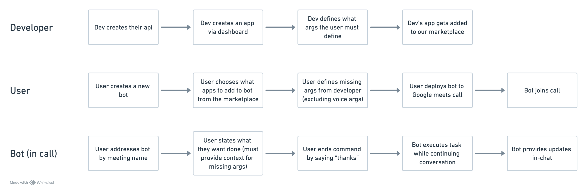
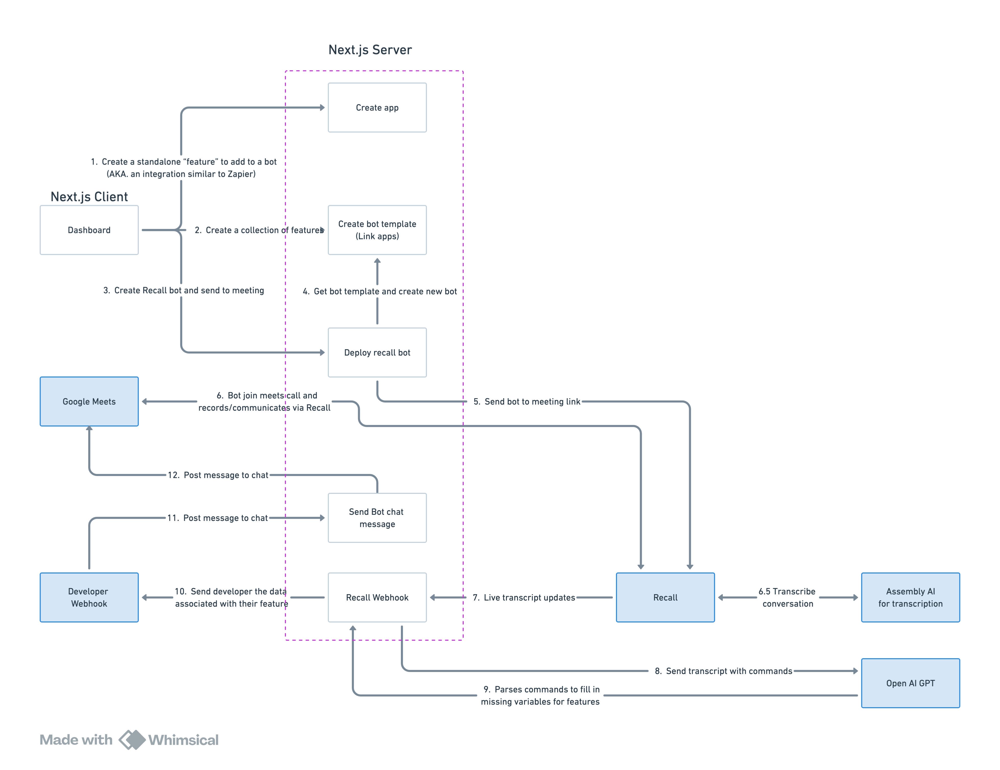

# Recall-Zapier

## 🎩 Introduction

Recall-Zapier serves as a bridge between google meets and various applications, leveraging [Recall AI](https://www.recall.ai/) and [OpenAI](https://openai.com/api/) APIs

It enables users to create custom no-code bots to automate tasks and streamline workflows during google meets calls

The cool thing is you can speak to it in natural language, and it will trigger actions in other apps (similar to how you would build and use a Zapier integration)

Just ask [bot name] to do the thing and thank them for their time (the command structure) and they will take care of the rest!

## 🧩 Features

For Developers:

- **Create your own app/integration**: Any developer can create a trigger to their app that any user can activate in a call through their bot
- **Communicate with the call through the bot**: Follow up with messages in-chat with a simple-to-use API

For Users:

- **No-Code Bot Creation**: Easily set up a bot by selecting which features you want, built by our team and the community (Gerry is both the team and the community at this point 🤣)
- **Voice-Activated Triggers**: Activate the bot and execute commands using natural language during your calls
- **User-Friendly Interface**: Build a bot in as little as 30 seconds, then make them join your next call with a single click

Current Integrations:

- **Google Docs**: Create a new google doc for the team to join (POC: posts a link to docs.new)
- **Slack Ping**: Ping a slack channel to notify the team to join the call (POC: pings discord because I don't have slack)

Note: These integrations are just POCs to showcase the trigger system and are independent of the main app. These can be improved pretty quickly to become fully functional if needed by the developer who created the integration

Flows:

The above image shows the flow for the different types of users (developer, user, and bot) and how they interact with the system

## ⚙️ API

We currently have the following APIs:

- POST `/api/v1/bot/[botId]/message` - Send a message to the chat in live calls
  - body:
    - `message`: `string` - The message to send to the chat
    - NOTE: This is not the recall bot ID but the actual bot id found in the dashboard

## 📁 Repository Structure

The application follows a typical Next.js structure with some custom organization:

```
src/
├── app/                   # Most client-side code
│   ├── (client)/          ## Client-side routes and components
│   │   ├── auth/          ## Authentication pages and components
│   │   └── dashboard/     ## Dashboard features (apps, bots, templates)
│   └── api/               ## API routes
│       ├── apps/          ## App CRUD endpoints
│       ├── bot-templates/ ## Bot template management
│       ├── bots/          ## Bot deployment and control
│       ├── v1/            ## Developer-accessible API routes for this app
│       └── webhook/       ## Webhook listeners (Recall.ai, the dummy developer app webhook is also found here)
│
├── components/            # Shared components
│   ├── api/               ## Hooks to query the backend
│   ├── hooks/             ## ShadCN react hooks
│   ├── lib/               ## Client-side shared utilities and types
│   ├── providers/         ## Wrappers used in the main layout
│   └── ui/                ## Shared UI components
│
├── config/                # Environment variables and configuration
│   ├── env.mjs            ## Environment variables
│   ├── nextAuth.ts        ## NextAuth configuration
│   ├── prisma.ts          ## Prisma client
│   └── redis.ts           ## Redis client
│
├── lib/                   # Shared utilities and types
│   ├── constants/         ## Shared enums and constants used throughout the app
│   └── schemas/           ## Zod validation schemas/types used throughout the app
│
├── server/                # Server-side business logic
│   ├── services/          ## Core services
│   │   ├── DbService/     ### Database operations for each model
│   │   ├── OpenAiService  ### GPT wrapper
│   │   ├── RecallService  ### Recall.ai wrapper
│   │   └── LoggerService  ### Logger wrapper
│   └── routers/           ## Internal API routing logic
│       └── webhooks/      ### Webhook-event routers
│
└── types/                 # Shared types used throughout the app
```

## 🏗 Architecture



#### Architecture Description

This architecture diagram illustrates the flow of the Recall-Zapier system, highlighting how the Next.js client and server interact with external APIs, webhooks, and platforms like Google Meet to enable its functionality.

---

###### **Next.js Client**

1. **Dashboard**:

   - Users start by creating standalone "features" called apps (similar to Zapier integrations).
   - These features are then grouped into a collection to form bot templates which bots are deployed from.

2. **Bot Deployment**:
   - Users send a bot to a meeting.

---

###### **Next.js Server**

1. **App Creation**:

   - The server handles requests from the client to create apps (feature collections).

2. **Bot Template Management**:

   - Templates are created by linking external apps.
   - The server creates bots from the bot template

3. **Bot Management**:

   - The server manages the meeting bot's (separate from the bot in the bot template) lifecycle, including joining meetings and sending messages.

4. **Webhook Listeners**:

   - Recall communicates to the server via webhooks, posting live transcriptions
   - Server parses the transcriptions and derives commands/actions through OpenAI's GPT
   - Server triggers the appropriate actions according to which app commands were executed

5. **Webhook Emitters**:

   - The server emits webhooks to the developer's servers when the apps' commands are executed

---

###### **Recall**

1. **Live Interaction**:

   - Recall processes the live meeting data, including transcriptions and commands.
   - The bot communicates with third-party services for transcription and natural language processing:
     - **Assembly AI**: Used for transcribing the meeting conversation.
     - **OpenAI GPT**: Processes transcripts, parses commands, and fills in missing variables for executing features.

---

###### **Flow Summary**

- The user configures bots via the Next.js client and server.
- Bots join Google Meet meetings, interact in real-time, and leverage AI services for transcription and command execution.
- Results are communicated back to the meeting and, optionally, to developer-defined webhooks.

This design integrates Google Meet with Recall and OpenAI, enabling powerful, real-time automation through voice commands via a no-code interface.

Feel free to explore the capabilities of Recall-Zapier and transform the way you interact in your Google Meet sessions!

# 🚀 Getting Started

## Prerequisites

- Node.js
- npm
- Docker

## Start the development server

1. Clone the repo
2. Update the `.env.example` file with your environment variables and rename it to `.env`
3. Run `npm install` to install the dependencies
4. Run `npm dev` to start the development server
